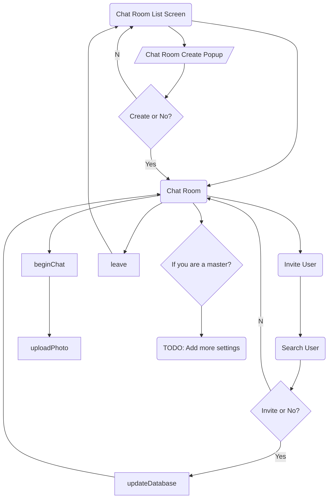
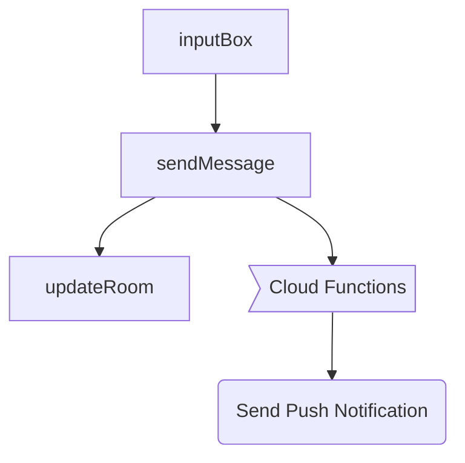

# Example App of EasyChat

* Example App for easy understading of how you can use EasyChat.

## Flowchart

### Chat room life cyle flowchart

### Chat message send flowchart

### Photo send flowchat

